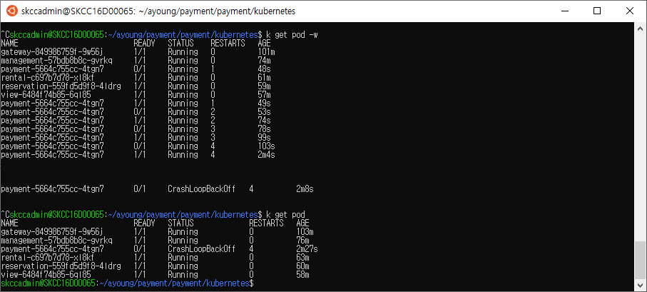
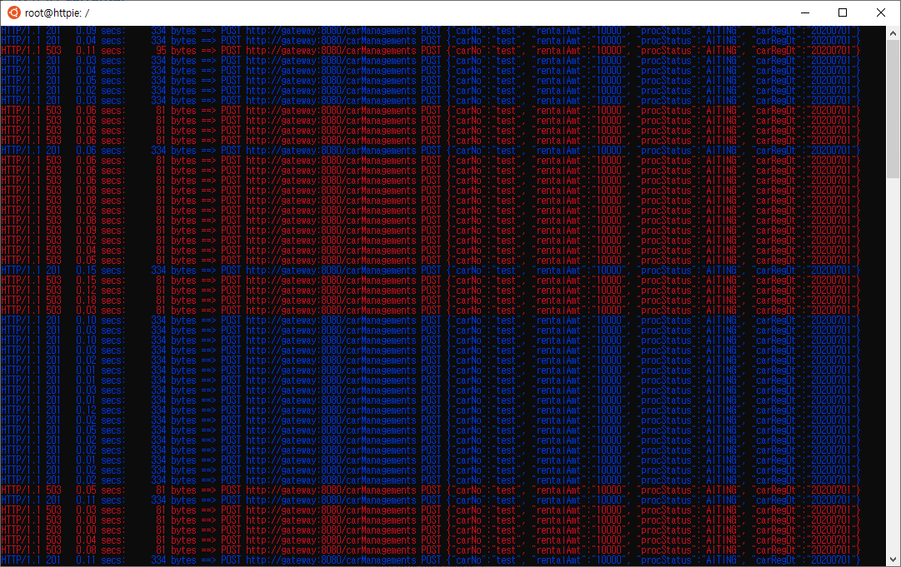
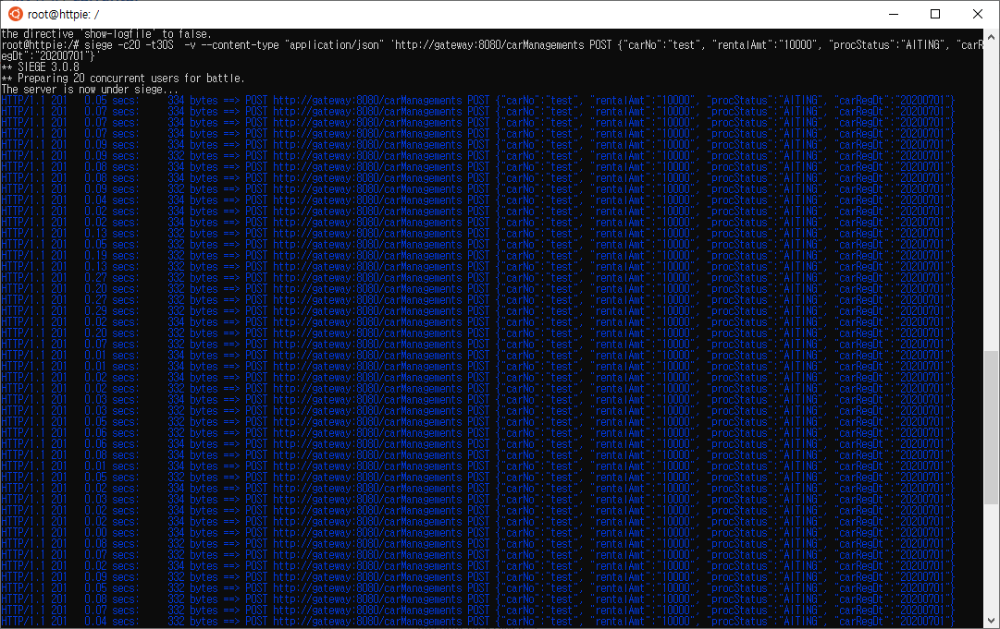
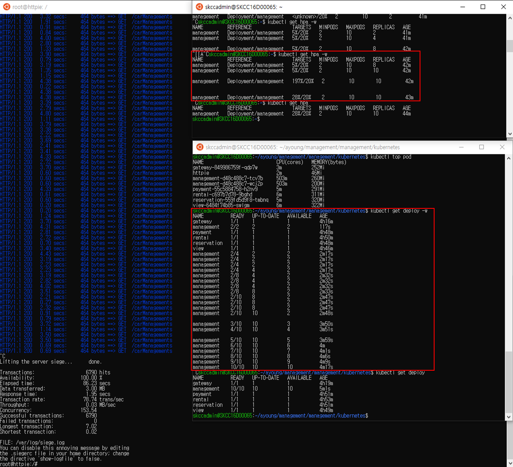

# Liveness
/tmp/healthy 파일의 존재를 확인하는 liveness를 적용하였다.   
3초동안 파드가 뜨기를 기다렸다가 파드가 뜨지 않았을 경우 최대 5번까지 재시도 한다. 
이때, /tmp/healthy를 지워버리므로 liveness는 pod상태가 정상이 아니라고 판단한다.   
5번 재시도 후에도 파드가 뜨지 않았을 경우 CrashLoopBackOff 상태가 된다.   
```yaml
apiVersion: apps/v1
kind: Deployment
metadata:
  name: payment
  labels:
    app: payment
spec:
  replicas: 1
  selector:
    matchLabels:
      app: payment
  template:
    metadata:
      labels:
        app: payment
    spec:
      containers:
        - name: payment
          image: 496278789073.dkr.ecr.ap-northeast-2.amazonaws.com/ecr-skcc-team2-payment:v1
          args:
          - /bin/sh
          - -c
          - touch /tmp/healthy; sleep 10; rm -rf /tmp/healthy; sleep 600;
          ports:
            - containerPort: 8080
          readinessProbe:
            httpGet:
              path: '/actuator/health'
              port: 8080
            initialDelaySeconds: 10
            timeoutSeconds: 2
            periodSeconds: 5
            failureThreshold: 10
          livenessProbe:                 #적용 부분
            exec:
              command:
              - cat
              - /tmp/healthy
            initialDelaySeconds: 3
            timeoutSeconds: 2
            periodSeconds: 5
            failureThreshold: 5
```
#### 테스트 결과 



## ISTIO
istio 설치 후 deploy재기동 
```
cd istio
curl -L https://git.io/getLatestIstio | ISTIO_VERSION=1.4.5 sh -
cd istio-1.4.5
export PATH=$PWD/bin:$PATH
for i in install/kubernetes/helm/istio-init/files/crd*yaml; do kubectl apply -f $i; done
kubectl apply -f install/kubernetes/istio-demo.yaml
kubectl get pod -n istio-system
kubectl label ns default istio-injection=enabled
```
httpie 설치 및 테스트
```
kubectl exec -it httpie bin/bash
http http://gateway:8080/carManagements carNo=test rentalAmt=10000 procStatus=WAITING carRegDt=20200701
http http://gateway:8080/carManagements carNo=car01 rentalAmt=10000 procStatus=WAITING carRegDt=20200701
http http://gateway:8080/carManagements carNo=car02 rentalAmt=20000 procStatus=WAITING carRegDt=20200702
http http://view:8080/carInformations
```
  

# 서킷 브레이커
```
$ kubectl scale deploy management --replicas=2

$ kubectl apply -f - <<EOF
apiVersion: networking.istio.io/v1alpha3
kind: DestinationRule
metadata:
  name: management
spec:
  host: management
  trafficPolicy:
    connectionPool:
      tcp:
        maxConnections: 1
      http:
        http1MaxPendingRequests: 1
        maxRequestsPerConnection: 1
    outlierDetection:
      consecutiveErrors: 5
      interval: 10s
      baseEjectionTime: 30s
      maxEjectionPercent: 100
EOF
```
부하 명령어
```
siege -c20 -t30S  -v --content-type "application/json" 'http://gateway:8080/carManagements POST {"carNo":"test", "rentalAmt":"10000", "procStatus":"WAITING", "carRegDt":"20200701"}'
```

#### 적용 시 


#### 서킷 브레이커 삭제 

```
$ kubectl delete dr --all
siege -c20 -t30S  -v --content-type "application/json" 'http://gateway:8080/carManagements POST {"carNo":"test", "rentalAmt":"10000", "procStatus":"WAITING", "carRegDt":"20200701"}'
```


# retry
적용은 하였으나, 예상한 결과값을 보지 못함
#### retry 리소스 생성
```
$ kubectl apply -f - <<EOF
apiVersion: networking.istio.io/v1alpha3
kind: VirtualService
metadata:
  name: reservation
spec:
  hosts:
  - reservation
  http:
  - route:
    - destination:
        host: reservation
    retries:
      attempts: 3
      perTryTimeout: 2s
EOF
```
#### 적용 상태에서 요청
```
$ siege -c5 -t30S  -v --content-type "application/json" 'http://gateway:8080/carReservations POST {"carNo":"car01", "custNo":"cus01", "paymtNo":"pay20200801Seq0001", "procStatus":"RESERVED", "rentalAmt":"10000", "resrvNo":"res20200801Seq0001", "resrvDt":"20200801", "rentalDt":"20200802", "returnDt":"20200805"}'
** SIEGE 3.0.8
** Preparing 5 concurrent users for battle.
The server is now under siege...
HTTP/1.1 500   0.04 secs:     257 bytes ==> POST http://gateway:8080/carReservations POST {"carNo":"car01", "custNo":"cus01", "paymtNo":"pay20200801Seq0001", "procStatus":"RESERVED", "rentalAmt":"10000", "resrvNo":"res20200801Seq0001", "resrvDt":"20200801", "rentalDt":"20200802", "returnDt":"20200805"}
HTTP/1.1 500   0.04 secs:     257 bytes ==> POST http://gateway:8080/carReservations POST {"carNo":"car01", "custNo":"cus01", "paymtNo":"pay20200801Seq0001", "procStatus":"RESERVED", "rentalAmt":"10000", "resrvNo":"res20200801Seq0001", "resrvDt":"20200801", "rentalDt":"20200802", "returnDt":"20200805"}
HTTP/1.1 500   0.04 secs:     257 bytes ==> POST http://gateway:8080/carReservations POST {"carNo":"car01", "custNo":"cus01", "paymtNo":"pay20200801Seq0001", "procStatus":"RESERVED", "rentalAmt":"10000", "resrvNo":"res20200801Seq0001", "resrvDt":"20200801", "rentalDt":"20200802", "returnDt":"20200805"}
HTTP/1.1 500   0.04 secs:     257 bytes ==> POST http://gateway:8080/carReservations POST {"carNo":"car01", "custNo":"cus01", "paymtNo":"pay20200801Seq0001", "procStatus":"RESERVED", "rentalAmt":"10000", "resrvNo":"res20200801Seq0001", "resrvDt":"20200801", "rentalDt":"20200802", "returnDt":"20200805"}
HTTP/1.1 500   0.02 secs:     257 bytes ==> POST http://gateway:8080/carReservations POST {"carNo":"car01", "custNo":"cus01", "paymtNo":"pay20200801Seq0001", "procStatus":"RESERVED", "rentalAmt":"10000", "resrvNo":"res20200801Seq0001", "resrvDt":"20200801", "rentalDt":"20200802", "returnDt":"20200805"}
HTTP/1.1 500   0.07 secs:     257 bytes ==> POST http://gateway:8080/carReservations POST {"carNo":"car01", "custNo":"cus01", "paymtNo":"pay20200801Seq0001", "procStatus":"RESERVED", "rentalAmt":"10000", "resrvNo":"res20200801Seq0001", "resrvDt":"20200801", "rentalDt":"20200802", "returnDt":"20200805"}
HTTP/1.1 500   0.04 secs:     257 bytes ==> POST http://gateway:8080/carReservations POST {"carNo":"car01", "custNo":"cus01", "paymtNo":"pay20200801Seq0001", "procStatus":"RESERVED", "rentalAmt":"10000", "resrvNo":"res20200801Seq0001", "resrvDt":"20200801", "rentalDt":"20200802", "returnDt":"20200805"}
HTTP/1.1 500   0.03 secs:     257 bytes ==> POST http://gateway:8080/carReservations POST {"carNo":"car01", "custNo":"cus01", "paymtNo":"pay20200801Seq0001", "procStatus":"RESERVED", "rentalAmt":"10000", "resrvNo":"res20200801Seq0001", "resrvDt":"20200801", "rentalDt":"20200802", "returnDt":"20200805"}
HTTP/1.1 500   0.04 secs:     257 bytes ==> POST http://gateway:8080/carReservations POST {"carNo":"car01", "custNo":"cus01", "paymtNo":"pay20200801Seq0001", "procStatus":"RESERVED", "rentalAmt":"10000", "resrvNo":"res20200801Seq0001", "resrvDt":"20200801", "rentalDt":"20200802", "returnDt":"20200805"}
HTTP/1.1 500   0.04 secs:     257 bytes ==> POST http://gateway:8080/carReservations POST {"carNo":"car01", "custNo":"cus01", "paymtNo":"pay20200801Seq0001", "procStatus":"RESERVED", "rentalAmt":"10000", "resrvNo":"res20200801Seq0001", "resrvDt":"20200801", "rentalDt":"20200802", "returnDt":"20200805"}
HTTP/1.1 500   0.03 secs:     257 bytes ==> POST http://gateway:8080/carReservations POST {"carNo":"car01", "custNo":"cus01", "paymtNo":"pay20200801Seq0001", "procStatus":"RESERVED", "rentalAmt":"10000", "resrvNo":"res20200801Seq0001", "resrvDt":"20200801", "rentalDt":"20200802", "returnDt":"20200805"}
HTTP/1.1 500   0.03 secs:     257 bytes ==> POST http://gateway:8080/carReservations POST {"carNo":"car01", "custNo":"cus01", "paymtNo":"pay20200801Seq0001", "procStatus":"RESERVED", "rentalAmt":"10000", "resrvNo":"res20200801Seq0001", "resrvDt":"20200801", "rentalDt":"20200802", "returnDt":"20200805"}
HTTP/1.1 500   0.03 secs:     257 bytes ==> POST http://gateway:8080/carReservations POST {"carNo":"car01", "custNo":"cus01", "paymtNo":"pay20200801Seq0001", "procStatus":"RESERVED", "rentalAmt":"10000", "resrvNo":"res20200801Seq0001", "resrvDt":"20200801", "rentalDt":"20200802", "returnDt":"20200805"}
```


# HPA
### autoscale 리소스 생성
```
kubectl autoscale deploy management --min=2 --max=10 --cpu-percent=10
```
```
apiVersion: autoscaling/v1
kind: HorizontalPodAutoscaler
metadata:
  name: management
  namespace: default
spec:
  maxReplicas: 10
  minReplicas: 2
  scaleTargetRef:
    apiVersion: extensions/v1beta1
    kind: Deployment
    name: management
  targetCPUUtilizationPercentage: 10
  metrics:
  - type: Resource
    resource:
      name: cpu
      targetAverageUtilization: 10
status:
  currentCPUUtilizationPercentage: 18
  currentReplicas: 2
  desiredReplicas: 4
```
```
kubectl delete hpa management
```

### deployment 수정
deployment.yaml의 containers하위에 추가
```
containers:
   resources:
      limits: 
        cpu: 500m
      requests:
        cpu: 200m
```

### 부하
```
# siege -r 2000 -c 200 -v http://gateway:8080/carManagements
```




# config
```
$ kubectl apply -f - <<EOF
apiVersion: v1
kind: ConfigMap
metadata:
  name: rental-region
data:
  contury: "korea"
  region: "seoul"
EOF
```
```

```
